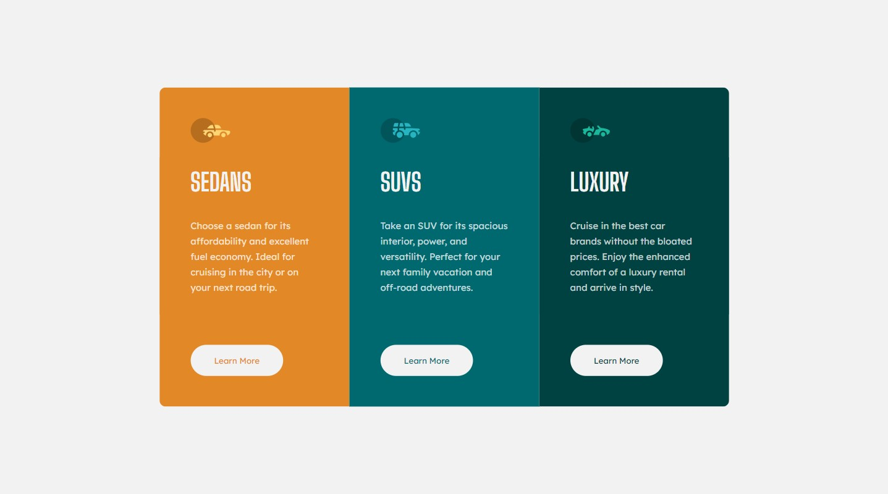

# Frontend Mentor - 3-column preview card component solution

This is a solution to the [3-column preview card component challenge on Frontend Mentor](https://www.frontendmentor.io/challenges/3column-preview-card-component-pH92eAR2-). Frontend Mentor challenges help you improve your coding skills by building realistic projects.

## Table of contents

- [Overview](#overview)
  - [The challenge](#the-challenge)
  - [Screenshot](#screenshot)
  - [Links](#links)
- [My process](#my-process)
  - [Built with](#built-with)
  - [What I learned](#what-i-learned)
  - [Useful resources](#useful-resources)
- [Author](#author)

## Overview

### The challenge

Users should be able to:

- View the optimal layout depending on their device's screen size
- See hover states for interactive elements

### Screenshot



### Links

- Solution URL: [Add solution URL here](https://your-solution-url.com)
- Live Site URL: [Add live site URL here](https://your-live-site-url.com)

## My process

### Built with

- Semantic HTML5 markup
- Sass preprocessor
- Flexbox
- CSS Grid
- Mobile-first workflow

### What I learned

```scss
@media screen and (min-width: 1000px)
```

I learned that with sass I need to use "and" in order to use the brackets when using a media query in sass. Additionally, I learned that .sass files are different to .scss files in that .sass files do not have curly brackets, semicolons and use indentation.

### Useful resources

- [Sass](https://sass-lang.com/guide/) - This was my first time using a .sass stylesheet so the guide on this page helped me to figure out why my sass code was failing to compile when I used semicolons!
- [W3 Schools](https://www.w3schools.com/css/css_rwd_mediaqueries.asp) - This is an amazing article which helped me finally understand mobile first web design.
I'd recommend it to anyone still learning this concept.

## Author

- Frontend Mentor - [@ishmaelsealey](https://www.frontendmentor.io/profile/ishmaelsealey)
- Instagram - [@ishmael.sealey](https://www.instagram.com/ishmael.sealey/)
